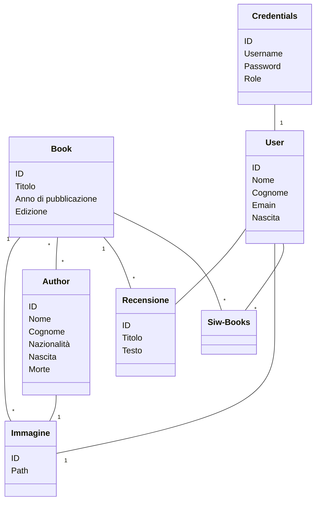

# SIW-Books
## Portale per organizzare libri
Progetto svolto per l'esame di "Sistemi Informativi sul Web" Sistema di gestione libri, relativi autori e recensioni

## Author

# Casi d’Uso

## Operazioni comuni
- **UC1: Ricerca di un libro per titolo o anno di uscita**  
  **Attori:** Utente registrato, Utente occasionale  
  **Descrizione:**  
  L’utente inserisce un titolo (o parte di esso) o un anno di pubblicazione, avvia la ricerca e visualizza la lista dei libri corrispondenti.

- **UC2: Ricerca di un autore per nome o cognome**  
  **Attori:** Utente registrato, Utente occasionale  
  **Descrizione:**  
  L’utente digita il nome o il cognome di un autore, lancia la ricerca e ottiene i dettagli degli autori trovati.

  - **UC3: Ricerca di un autore per nome o cognome**  
  **Attori:** Ogni tipo di utente  
  **Descrizione:**  
  L'utente seleziona la pagina del proprio profilo e decide di cancellarlo, rimuovendo tutti i dati correlati.

  - **UC4: Ricerca di un autore per nome o cognome**  
  **Attori:** Ogni tipo di utente  
  **Descrizione:**  
  L'utente seleziona la pagina del proprio profilo e decide di modificarne le info, gli utenti che hanno acceduto tramite OAuth2 non hanno il permesso di eseguire questa operazione.

---

## Admin
- **UC5: Cancellazione di un utente**  
  **Attore principale:** Admin  
  **Descrizione:**  
  L’amministratore seleziona un utente dalla lista, conferma l’eliminazione e il sistema rimuove l’account (e tutti i dati correlati).

- **UC6: Aggiunta di un nuovo libro**  
  **Attore principale:** Admin  
  **Descrizione:**  
  L’admin compila i campi del libro (titolo, anno), associa uno o più autori esistenti, carica una o più immagini e conferma l’inserimento.

- **UC7: Cancellazione di un libro**  
  **Attore principale:** Admin  
  **Descrizione:**  
  L’admin sceglie un libro dall’elenco, conferma la rimozione e il sistema lo elimina definitivamente (insieme a eventuali recensioni e alle eventuali immagini presenti sul filesystem).

- **UC8: Aggiunta di un nuovo autore**  
  **Attore principale:** Admin  
  **Descrizione:**  
  L’admin inserisce nome, cognome e nazionalità dell'autore, può associare alcuni libri già presenti e caricare un’immagine, poi salva.

- **UC9: Cancellazione di un autore**  
  **Attore principale:** Admin  
  **Descrizione:**  
  L’admin seleziona un autore, conferma l’eliminazione e il sistema rimuove l’autore (eventuali libri restano, ma perdono il riferimento, l'immagine relativa a quell'autore viene cancellata dal filesystem).

- **UC10: Cancellazione di qualsiasi recensione**  
  **Attore principale:** Admin  
  **Descrizione:**  
  L’admin individua una recensione (su un libro), conferma la rimozione e il sistema elimina la recensione.

---

## Utente registrato
- **UC11: Aggiunta di una recensione a un libro**  
  **Attore principale:** Utente registrato  
  **Descrizione:**  
  L’utente seleziona per quale libro scrivere la propria recensione composta da titolo voto e testp e invia. Se ha già recensito quel libro, il sistema non permette un secondo invio.

- **UC12: Cancellazione della propria recensione**  
  **Attore principale:** Utente registrato  
  **Descrizione:**  
  L’utente trova la recensione che ha scritto, clicca “Elimina” e conferma: il sistema rimuove solo la sua recensione.

---

## Utente occasionale
- Nessun caso d’uso specifico al di fuori delle **Operazioni comuni** (UC1, UC2).
