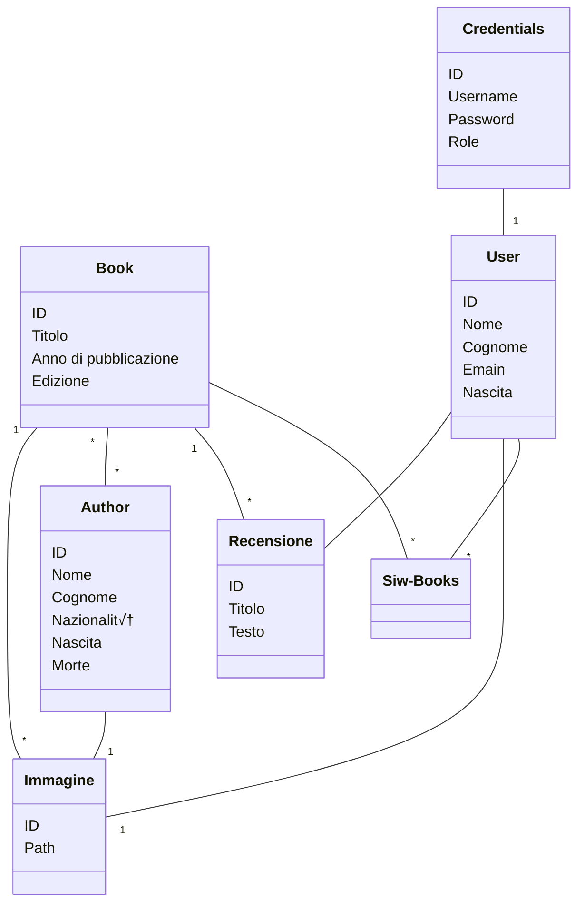

# SIW-Books
## Portale per organizzare libri
Progetto svolto per l'esame di "Sistemi Informativi sul Web" Sistema di gestione libri, relativi autori e recensioni

## Author

```mermaid
classDiagram

  class Siw-Books {

  }
  
  class Book {
    ID
    Titolo
    Anno di pubblicazione
    Edizione
  }

  class Author {
    ID
    Nome
    Cognome
    Nazionalità
    Nascita
    Morte
  }

  class Recensione {
    ID
    Titolo
    Testo
  }

  class Immagine {
    ID
    Path
  }

  class User {
    ID
    Nome
    Cognome
    Emain
    Nascita
  }

  class Credentials {
    ID
    Username
    Password
    Role
  }

  Credentials  -- "1" User
  User -- "*" Siw-Books
  Book -- "*" Siw-Books
  Book "1" -- "*" Recensione
  Book "*" -- "*" Author
  Book "1" -- "*" Immagine
  User -- "1" Immagine
  Author -- "1" Immagine
  User -- Recensione


```